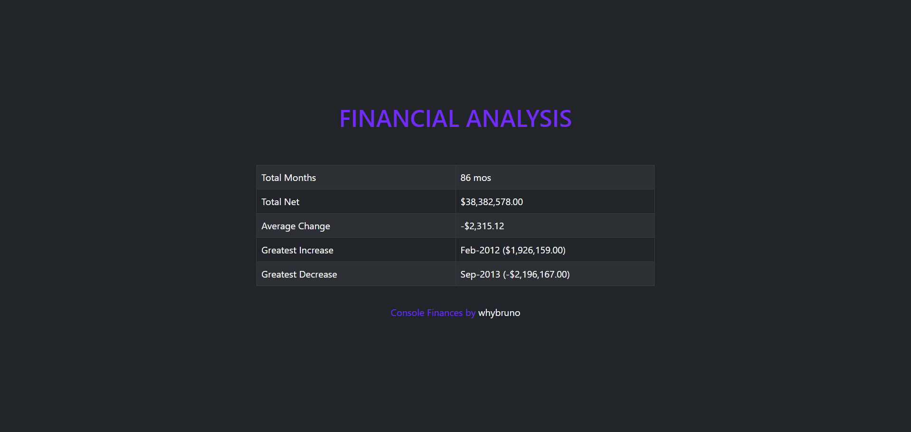
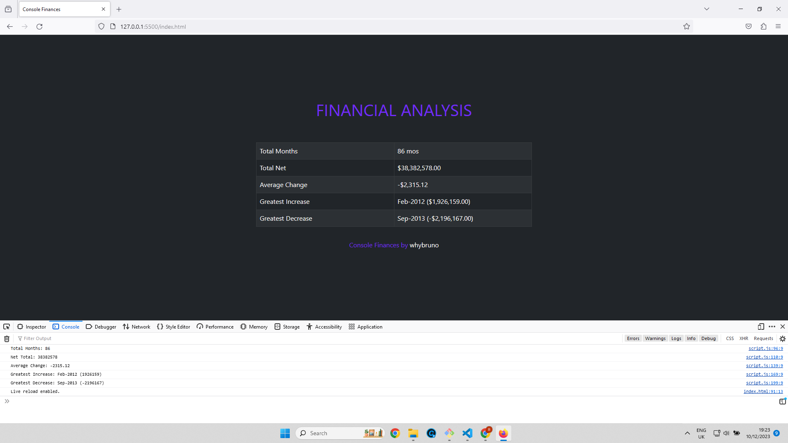

# :full_moon: About The Project

**Console-Finances**  is a Web App to analyze a company's financial records that shows the period, revenue, profits and losses. This is the challenge of the week at the **edX Front-End Web Development Bootcamp**.

# :waxing_gibbous_moon: Features

- JavaScript
- Bootstrap 5

# :first_quarter_moon: Screenshot

# :waxing_crescent_moon: Acceptance Criteria

- The total number of months included in the dataset.
- The net total amount of Profit/Losses over the entire period.
- The average of the **changes** in Profit/Losses over the entire period.
- The greatest increase in Profit/Losses (date and amount).
- The greatest decrease in Profit/Losses (date and amount).

# :new_moon: Technologies

- HTML
- CSS
- BOOTSTRAP 5
- JAVASCRIPT

# :globe_with_meridians: Website

- [Console-Finances](https://whybruno.github.io/console-finances)

# :copyright: Credits

- [MDN Web Docs](https://developer.mozilla.org/en-US/docs/Web/JavaScript/Reference/Global_Objects/Array/reduce)

# :registered: License

MIT License